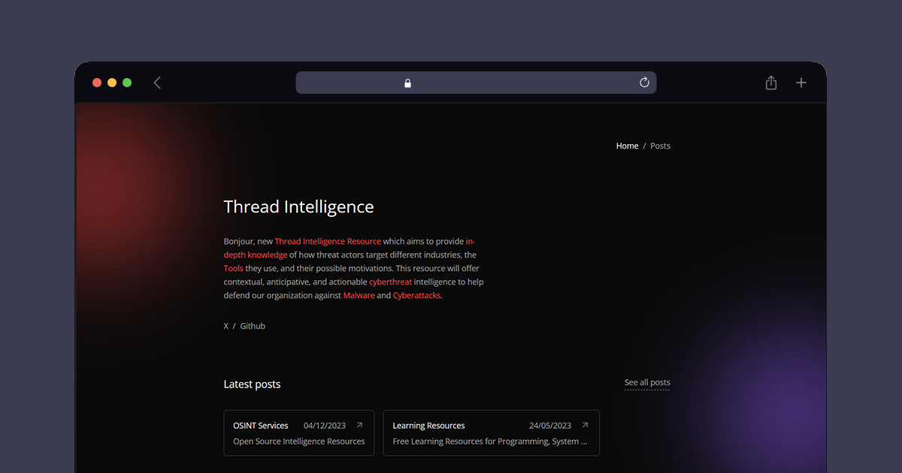

# 👨‍🚀 Astro - Thread Intelligence - OSINT Resources

## 🥷 Usage

- new Thread Intelligence Resource, which aims to provide in-depth knowledge of how threat actors target different industries, the tools they use, and their possible motivations. This resource will offer contextual, anticipative, and actionable cyberthreat intelligence to help defend our organization against malware and cyberattacks.

##  Commands

All commands are run from the root of the project, from a terminal:

| Command                   | Action                                           |
| :------------------------ | :----------------------------------------------- |
| `npm install`             | Installs dependencies                            |
| `npm run dev`             | Starts local dev server at `localhost:4321`      |

